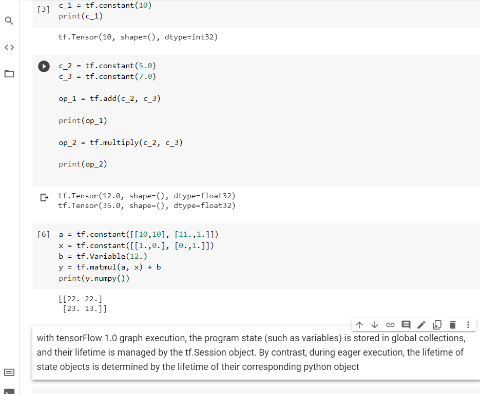
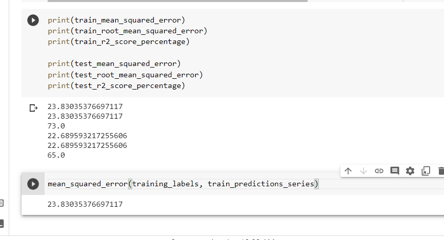
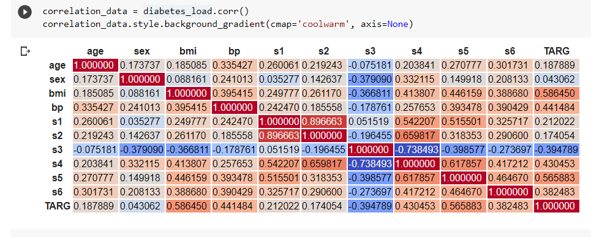

# Learn-Tensorflow-2.0-Pramod-Avinash
Implementing code given in the book

# Chapter 1 

Introduction to Tensorflow 2.0

Eager execution
1. Tensorflow 2.0 does not require graph definition
2. Tensorflow 2.0 does not require session execution
3. Need not initialise variables
4. Doesn't require variable sharing via scopes

tf.function to create graph

tf.keras -  simplicity of keras

image default datasets

imdb_reviews, squad
mnist, imagenet2012, coco2014, cifar10
moving_mnist, starcraft_video, bair_robot_pushing_small, Nsynth, titanic, iris

# chapter 2

Supervised Learning and Tensorflow

## Linear Regression Model using TensorFlow and Keras

Custom Linear Regression on Diabetes test

How to train the data though.

Page 51.

