# Learn-Tensorflow-2.0-Pramod-Avinash
Implementing code given in the book

This book also showcases how to deploy a machine learning application using flask

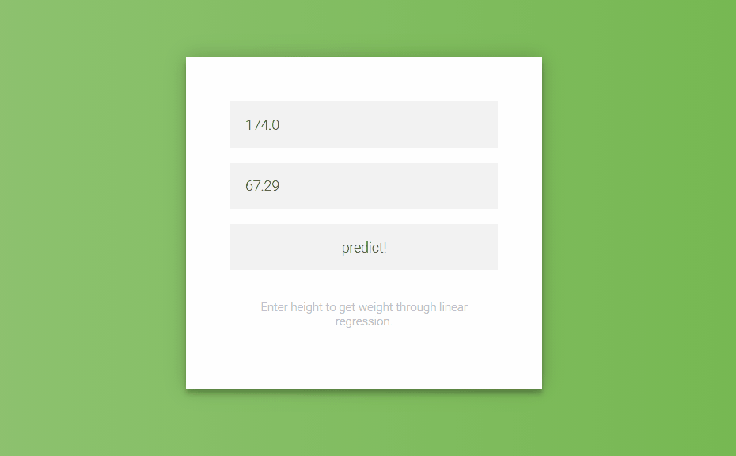

# Chapter 1 

Introduction to Tensorflow 2.0

Eager execution
1. Tensorflow 2.0 does not require graph definition
2. Tensorflow 2.0 does not require session execution
3. Need not initialise variables
4. Doesn't require variable sharing via scopes

tf.function to create graph

tf.keras -  simplicity of keras

image default datasets

imdb_reviews, squad
mnist, imagenet2012, coco2014, cifar10
moving_mnist, starcraft_video, bair_robot_pushing_small, Nsynth, titanic, iris

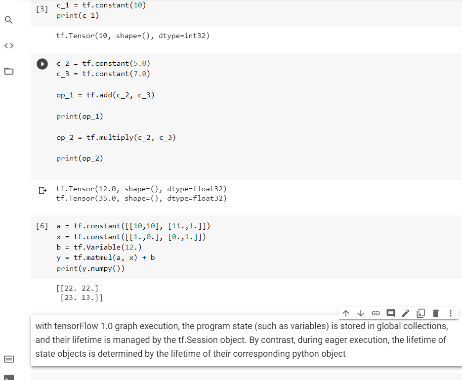

# chapter 2

Supervised Learning and Tensorflow

## Linear Regression Model using TensorFlow and Keras

Custom Linear Regression on Diabetes test

How to train the data though.

Page 51.

## Logistic Regression

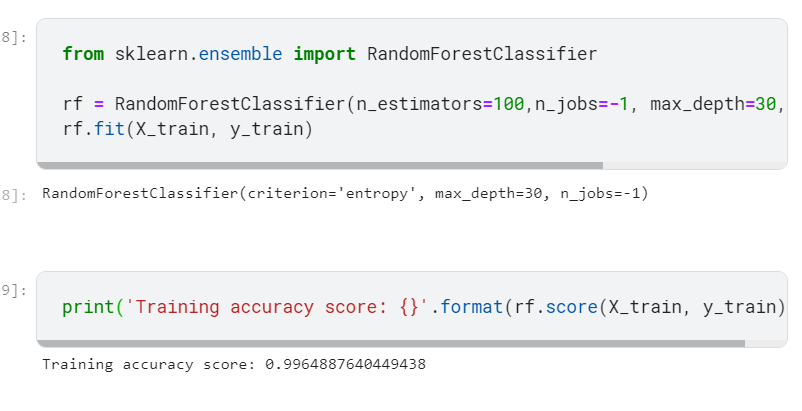

https://colab.research.google.com/drive/1KOOjBvur0UeB_MDClIX6CoWrqd0JnZVo#scrollTo=Oxcj9RalOuq2

page 57

## bagging and boosting

It is a technique wherin we build independent models/ predictors using random subsample/bootstrap of data of each of the models/predictors.

bagging all models train independently and finally the average is taken

boosting all models train sequentially and each model learns from the previous model.

## Gradient Boosting

Here instead of incrementing the weights of the misclassified learner we optimize the lossfunction of the previous learner.

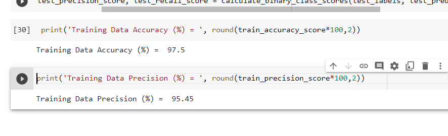

# chapter 3

Neural Networks and Deep Learning with TensorFlow

## Neural net fashion mnist

simple nn

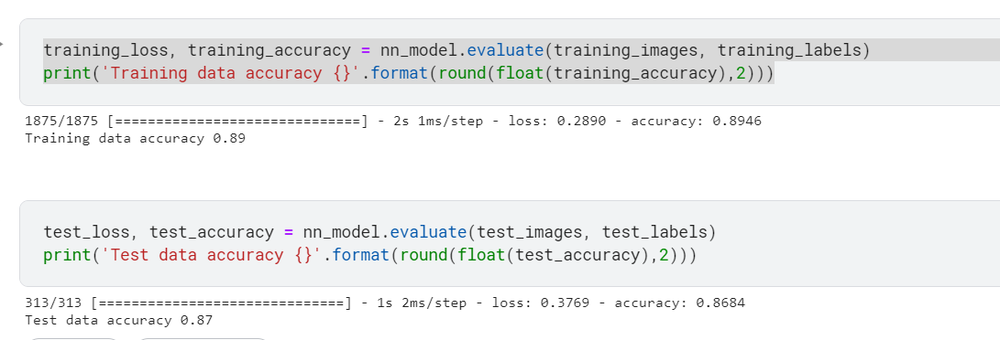

Deep nn

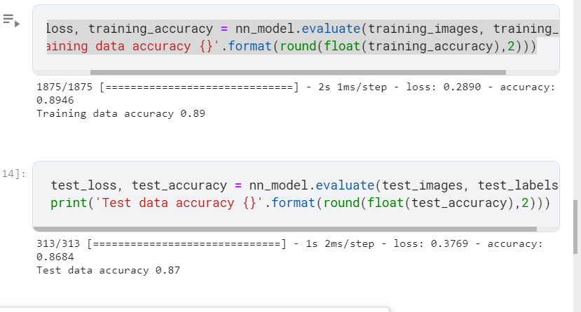

## Estimator using iris

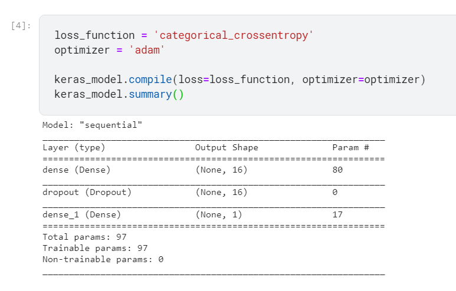

# chapter 4

Images with Tensorflow

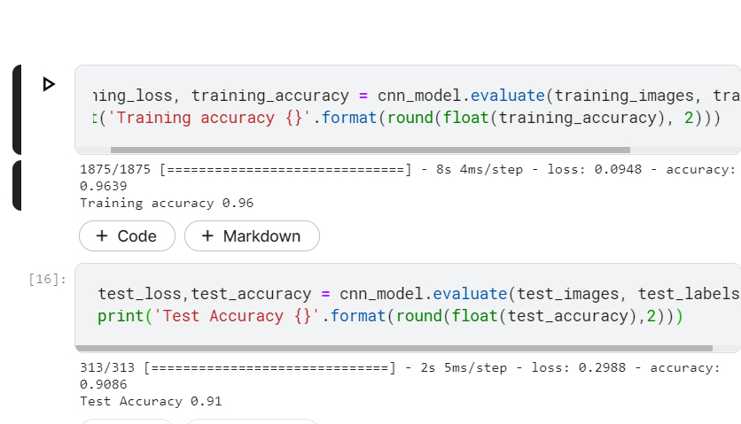

Advanced Convolutional Networks 

1. VGG-16
2. Inception
3. ResNet
4. DenseNet

### Autoencoders

A type of neural network used to generate output data in same unsupervised manner as for input data

autoencoder compresses the data to a form after encoding then decodes it.

Var is generating model same as autoencoder except it enforces autoencoder to follow a zeromean and a unit variance Gaussian distribution.

https://www.kaggle.com/fanbyprinciple/fashion-mnist-with-variational-autoencoder/edit

Page 115

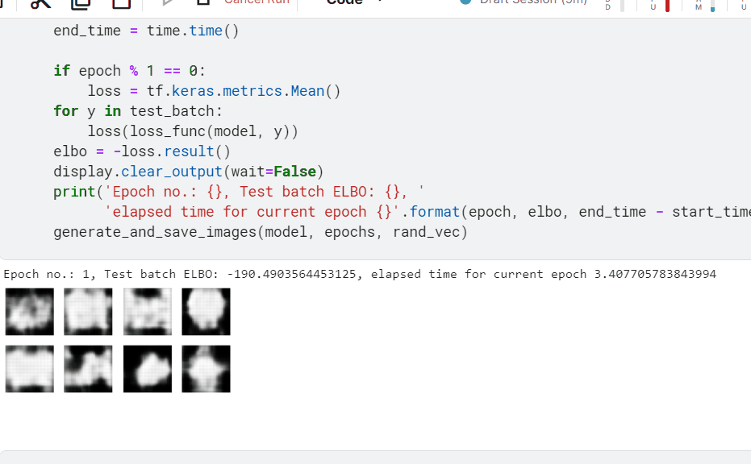

# chapter 5

Natural Language Processing with TensorFlow 2.0

Some of the applications of NLP in text category 

1. Reviews/ text classification
2. Text summarization
3. spam detection
4. audience segmentation 
5. Chatbot

Word embeddings - Numerical representations of text information, but much more powerful and relevantcompared to other methods, we can decide on the size of these embeddings as per need.

wordembeddings - 

1. Word2Vec
2. GloVe
3. fastText

### Text preprocessing

https://colab.research.google.com/drive/1ayqR_2t54Yw1ZCuljExORVMa8d6d6eIA

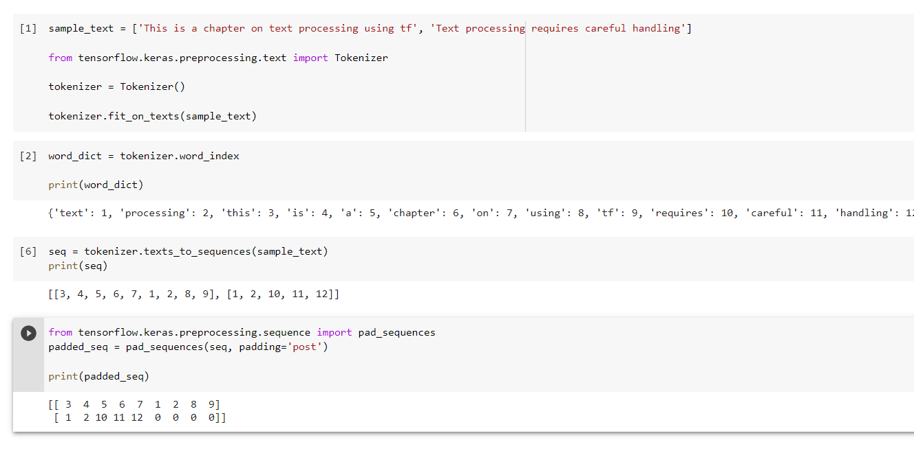

### Amazon product review

https://www.kaggle.com/fanbyprinciple/review-analysis-through-nlp-tensorflow/edit

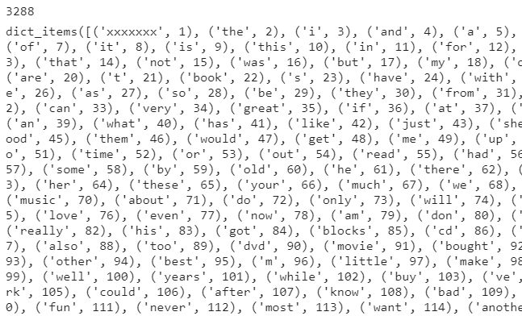

page 134

https://projector.tensorflow.org/?config=ashwin

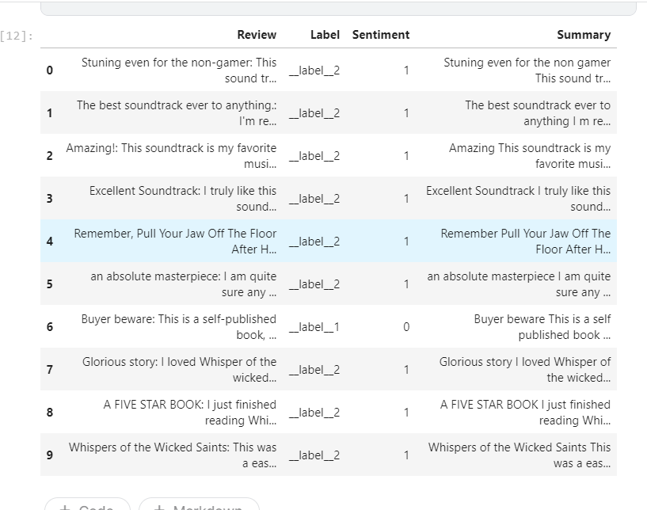

# Chapter 6

Tensorflow models in Production

creating a linear regression model

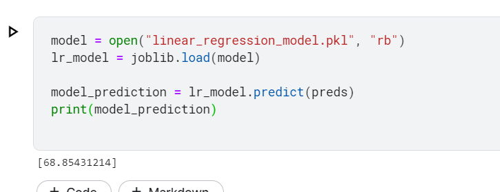

creating a REST Service using flask from above model

https://www.kaggle.com/fanbyprinciple/simple-linear-regression-weights-vs-height/edit/run/60493392

Working with fashion mnist data

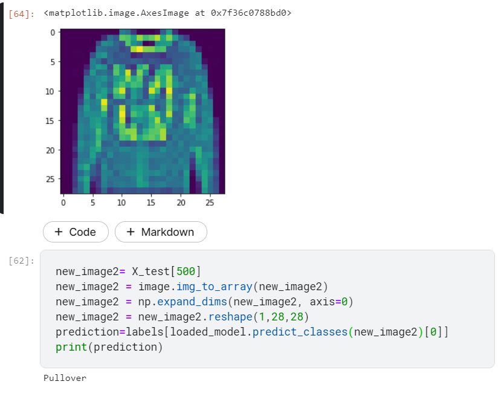

The book further suggests that I use a google cloud server for deploying  akubernetes based application.

# Takeaway from book

Maybe deploying a flask application. Rest the book is just code with slight introduction.